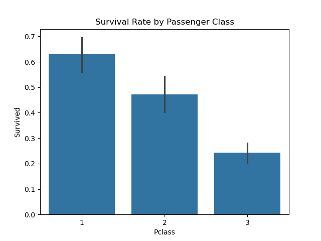
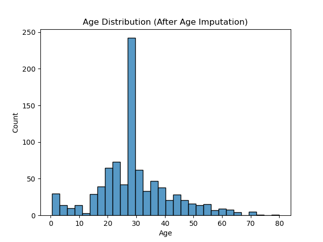
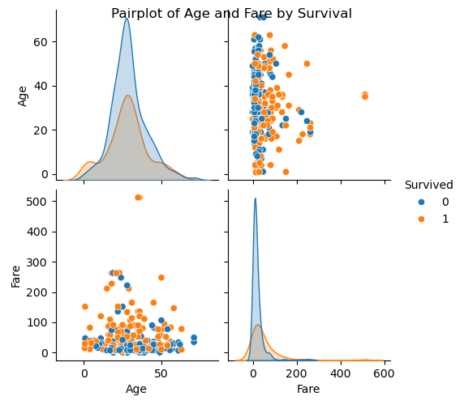

# Titanic Data Analytics Project

## Overview
Analysis and cleaning of the Titanic dataset, focusing on handling missing data and basic visualisation.

## Steps
1. Download train.csv from [Kaggle Titanic Competition](https://www.kaggle.com/competitions/titanic/data).
2. Run the Python script to:
   - Identify and handle missing values
   - Perform exploratory visualisation
   - Save cleaned dataset


| Data Dictionary       | Variable	Definition                             | Key                                               |
|-----------------------|--------------------------------------------------|---------------------------------------------------|
| survival              | Survival                                         | 0 = No, 1 = Yes                                   |
| pclass                | Ticket Class                                     | 1 = 1st, 2 = 2nd, 3 = 3rd                         |
| sex                   | Gender                                           |                                                   |
| Age                   | Age in years                                     |                                                   |
| sibsp                 | # of siblings / spouses aboard the Titanic       |                                                   |
| parch                 | # of parents / children aboard the Titanic       |                                                   |
| ticket                | Ticket Number                                    |                                                   |
| fare                  | Passenger fare	                                 |                                                   |
| cabin                 | Cabin number                                     |                                                   |
| embarked              | Port of Embarkation                              | C = Cherbourg, Q = Queenstown, S = Southampton    |


## Methods
- Dropped "Cabin" (mostly missing)
- Imputed "Age" with median (numeric)
- Imputed "Embarked" with mode (categorical)

## Requirements
- pandas, numpy, matplotlib, seaborn, missingno

## Structure
```plaintext
Titanic/
├── train.csv 
├── Titanic.ipnyb
├── README.md
└── Titanic_cleaned.csv
```
<!--the folder structure was still displaying as plain text, so used a fenced code block with language identifier for better formatting.
This tells the renderer that the block is plain text --> 


## Key Findings and Interpretations



### Interpretation insights:
- <b>Higher Survival in Higher Classes:</b> Passengers in 1st class have the highest survival rate (over 60%), followed by 2nd class (nearly 50%), and 3rd class with the lowest (about 25%). This shows a strong association between socio-economic status (as represented by ticket class) and likelihood of survival.

- <b>Class Gradient:</b> There is a clear survival gradient from 1st to 3rd class; moving to lower classes sharply decreases survival chances.

- <b>Error Bars/Confidence Intervals:</b> The black lines on top of each bar represent confidence intervals, showing the uncertainty around the estimated survival rate in each class.

<br>
<br>
<br>



### Interpretation insights:

- <b>Peak at Imputed Age:</b> There is a pronounced spike at the age value where missing values were imputed (at the median age around 28-30). This indicates that a significant portion of passengers had missing age values, and these have all been filled with the same value, causing a noticeable concentration at that point.

- <b>Age Distribution Shape:</b> Apart from the imputation peak, the rest of the age data follows a more typical distribution for a passenger dataset — most passengers are young to middle-aged adults, with counts tapering off above 40 years.

- <b>Data Imputation Impact:</b> The imputation method (e.g., median) can distort the real age distribution by adding an artificial spike. This may affect subsequent analyses, such as relationship between age and survival, so interpretation of age-based findings should acknowledge the imputed values.

<br>
<br>
<br>




### Interpretation insights:

- Denser populations of survivors within specific age ranges, such as younger passengers, indicating higher survival likelihood among the young.

- Fare distribution of survivors skews towards higher fare values, indicating passengers who paid more (likely in better classes) had better survival.

- The combined scatterplot lets you visually assess if younger passengers paying higher fares had higher survival rates.

<br>
<br>
<br>

Special mention and a vote of thanks to John Anih (https://github.com/JohnAnih) for his passion and guiding us on Data Analytics course.

<br>

## Contact
For questions or feedback, contact: Vish | https://github.com/vipai/
